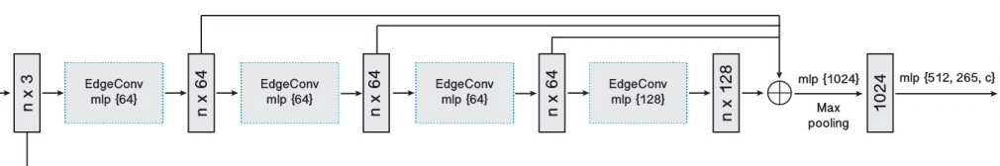
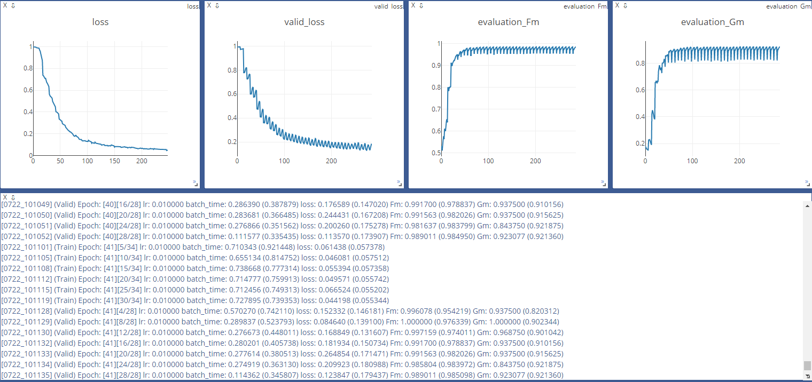

### HeterOgeneous graPh alignmEnt

----
In this repo, we want to align graph pair from different datasource through a graph convolutional network.

#### Dependencies package
- pytorch 1.1.0
- pytorch_geometric
- opencv-python (optional)
- numpy
- visdom
- matplotlib

More info about the package `pytorch_geometric`, please refer to [pytorch_geometric](https://pytorch-geometric.readthedocs.io/en/latest/notes/installation.html)

#### Data preparation

We use common dataset used in the field of the trajectory prediction here: ETH and UCY. These two datasets containes 5 crowd
sets with total of 1536 pedestrians. The datasets are recorded at 25 fps, annotated every 0.4 seconds and contain
4 different scenes.

To order to ensure the diversity of data, we sample the annotation data at intervals of 50 frames, that is , to sample at a 
frequency of 2 seconds each time. More details refer to `pre_process.py`

To simulate the graphs from heterogeneous data, we randomly decrement and pertub the vertices of the graph
as the result of image detection, and add noisy vertices as the result from single line radar data.
More details refer to `graph_simulation.py`

#### Architecture

We use a siamese structure to extract discriminative features where each branch is a resnet
block with edgegcn layer. The architecture of each branch is demonstrated as follow:



#### Train
- add your workpalce to the pythonpath
```buildoutcfg
export PYTHONPATH=<your/path/to/Hope>:$PYTHONPATH
```

- open you visdom server to observe the results
```buildoutcfg
python -m visdom.server
```

- train the network
```buildoutcfg
python trainval.py --gpu '0' --bs 64
```
- if you want to observe both train and validation results
```buildoutcfg
python trainval.py --trainval --gpu '0' --bs 64
```

#### Test
- [] TODO

#### Visualization
More details about the dataset you can find in `utils/visualize.py`.

The train and valid process you can observe through visdom server, refer to `Train`.


